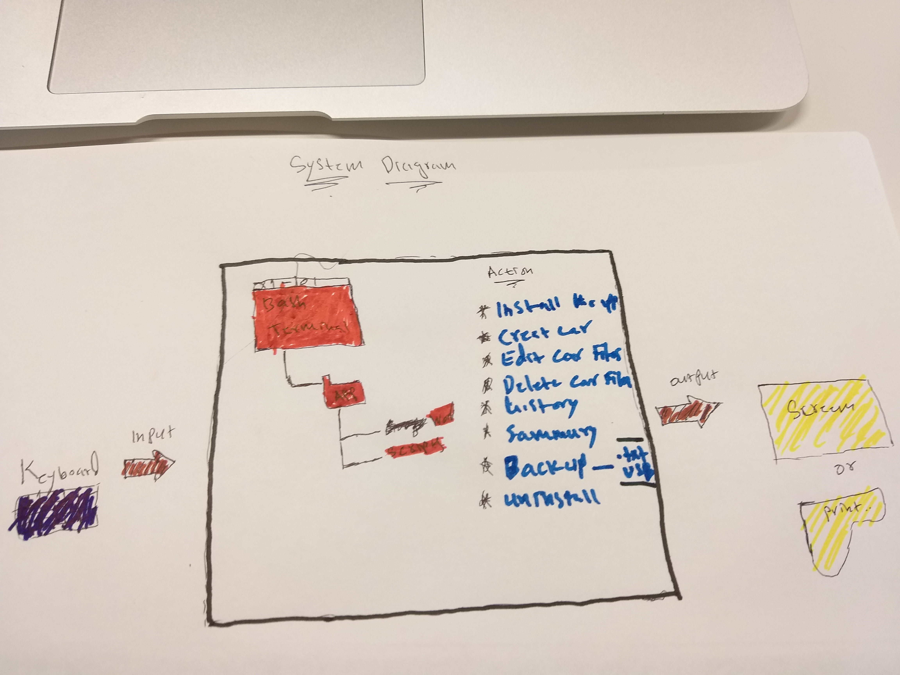

Car Rental Minimal App
===========================

A car rental management minimal app in Bash.

Contents
-----
  1. [Planning](#planning)
  1. [Design](#design)
  1. [Development](#development)
  1. [Evalution](#evaluation)

Planning
----------
### Definition of the problem (update this part)
A car rental office wants to buy a computer program that can record all their information about their cars. This Program will help the clients to record the car that they took and how long their trip was and the history of the car for all its trips. They require the program to be simple so that it wouldn’t confuse the users and the owners of the company. For the program to be simple, it needs to contain simple commands which can be used by anyone without needing any instructions from the program designer. This program needs to be delivered to the company in the simplest way possible. Every time that they use their program, all their data need to be saved so that they could recall it later for more information. This program will store all their data which makes them keep track of their financial system. 

### Proposed solution
The car rental office proposed a simple program that would keep track on all their informations and sustain their financial system. So to make their program simple, I created an easy install and uninstall program that can make them use the program in their computers or remove it if they want. After they install, everything they need will be in the folder that would be provided and everything is simple and easy with just one step process. The language that I used is bash script, the reason why I chose the bash script is because it's in the computer and you don't need to install it from somewhere else. Overall, the program is simple as the car rental office proposed and it will help all their needs. 

### Success Criteria
These are outcomes that can be measured
1. A car can be created
2. A trip can be recorded for a given car
3. A summary (Total distance traveled, average) of trips can be requested
4. A car information can be edited
5. A basic working backup system is available
6. The user can easily (name notation, documantation) understand the commands
7. Installation is **simple**, it does not require additional software, one step process
8. A car information can be deleted
9. The application can be uninstall


Design
---------
### First Sketch of System

**Fig. 1** This diagram shows the main components of the minimal 
rental app. It includes the input/output and main action.

### Second Sketch of system

**Fig. 1** This diagram creates a frame on the important words
that the program will use. 

Development
--------
### 1. Script for installation
The script below creates the folder structure for the application
```.sh
#!/bin/bash

#this program creates the folder structure for the minimal rental app

echo "Starting Installation"
echo "Installing in the desktop (default). press enter"
read
cd ~/Desktop

#Create app folder
mkdir RentalCarApp

cd RentalCarApp

mkdir database
mkdir scripts
echo "Installation complete successfully"

```
### 2. Script for uninstallation
This script below will delete the created folders for the minimal rental app
```.sh
#!/bin/bash

#this program will delete the created folders for the minimal rental app

echo "Starting to uninstall"
echo "uninstalling in the desktop (default). press enter"
read
cd ~/Desktop

rm -r RentalCarApp


echo "uninstallation complete successfully"
```

This script meets the requirement of the client for a simple installation and uninstallation 
however, it could be simplified so that the user does not need to execute the program by typing ``bash install.sh``

###problem solving
1. How to detect a word's length is odd or even?
  A. you use the module sign which is %, and this sign will show if the length of the word is even or odd. We also use if statement with the module sign and it can be state it this way. len which is the length of the of the word % 2, if the outcome is 1 then the word is odd if its 0 then the word is even. 

### Developing the action create new car
This process involves the inputs _,_,_,_, and the outputs:
the following steps describe the algorithm
1. Get the input as argumanets `$1 $2 $3 $4`
2. check number of argumetns (4) `$#`
3. Store new car inside `Maincarfile.txt`
4. create file for recording trips as plate.txt
`echo "Lxq912 nissan 2000 8" >> Maincarfile.txt`
`echo " " > plate.txt`
 
 Coding 
```.sh
#!/bin/bash

if [$# -ne 4 ]; then
	echo "Error with the number of arguments"
	echo "Enter LIcense Maker Model Passengers"
	exit
fi
lIcense=$1 
maker=$2
model=$3
pp=$4

echo "$license $maker $model $pp" >> db/maincarfile.txt
echo "" > $license.txt
```

bash frame "Installation Complete"
### Developing the action of recording trip
1. get the arguments and check (2)
2. check that the car exist `test license.txt`
3. add a new line to the file `license,txt`
4. end

coding
```.sh
#!/bin/bash

if [ $# -ne 2 ]; then
	echo "Error with the number of arguments"
	echo "Enter License distance"
	exit
fi

km=#2
license=#1
#check if the file exist
if [ ! -f "$license.txt" ]; then
	echo "Car does not exist"
	exit
fi
echo "$km" >> $license.txt
bash frame "Trip recorded successfully"
```

Evaluation
-----------
Test 1: A car can be created and stored in the database
For this purpose we will create the file testcreate.sh. This is called software testing 

The first step is to check for the file

```.sh
#!/bin/bash

#This file checks if the action create successfully addsa new car.

#step 1: navigate to the folder containing the create.sh file
cd ../scripts/
if [ -f "create" ]; then
        echo "File exists, test will start now"
else
        echo "File create.sh doesn't exist. Test Failed"
fi

#step 2: Use the create script to record a new car TXM901 nissan red 9
bash create TXM901 nissan red 9

#step 3: check that a txt file was created inside the database folder with
#the license number
cd ../Database
if [ -f "TXM901.txt" ]; then
        echo "Test One: File with the license place created successfully. passe$
else
        echo "Tes one: file with license number not found: failing"
fi
```

This file check all the criteria.

This test corresponds to dynamic, alpha, and white box test. The reason why it corresponds to those three tests is
because all of them require a person who knows how the program is designed or the person who actually designed it. 
For the dynamic test, you need to excute the programming code and test it with a set of given cases. For the alpha testing
you need the developers to use the program and see if it actually works or not. White box test is the last test that have been used which is examing the code that is used to create the program. All these types of testing is used for this program. 

